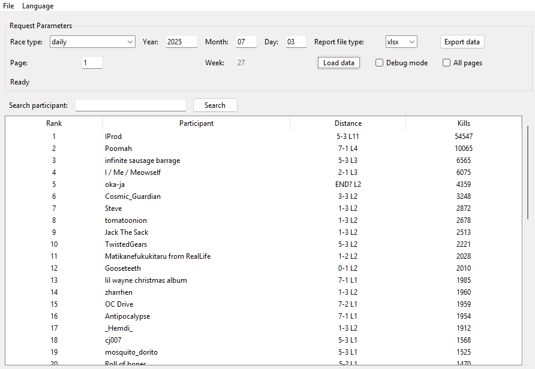

# ThroneButt Parser


An application for parsing daily and weekly race results from ThroneButt website with data export capabilities.

## Key Features

- Multi-language support
- Participant search by name
- Tabular results display
- Export data in multiple formats:
  - XLSX (Excel)
  - CSV
  - TXT
- Data loading options:
  - Single page
  - All pages automatically
- Debug mode for developers

## Installation

1. Clone the repository:

```bash
git clone https://github.com/yourusername/thronebutt-parser.git
cd thronebutt-parser
```

2. Install dependencies:

```bash
pip install -r requirements.txt
```

## Usage

### Launching the Application

```bash
python main.py
```

### Basic Workflow

1. Select "daily" race type
2. Enter current year, month, and day
3. Click "Load Data"
4. To export results, click "Export Data" and select format

## Demo



---

Developed for Nuclear Throne community | [ThroneButt](https://beta.thronebutt.com)
